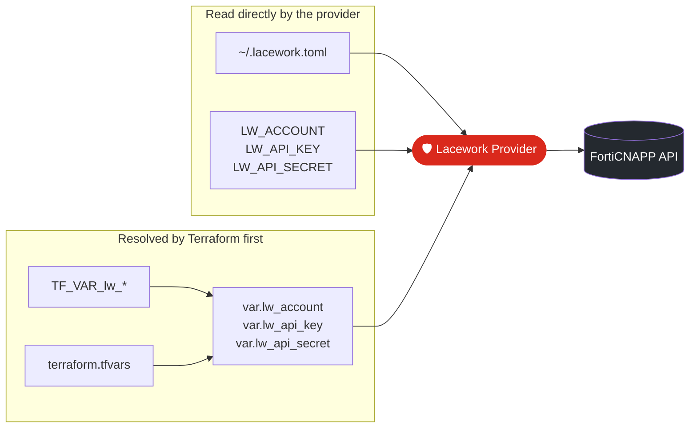
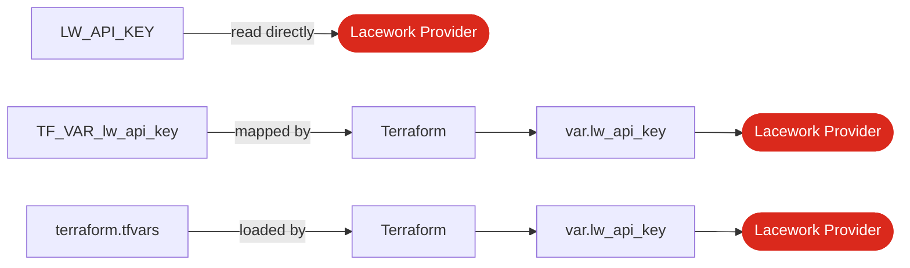

<div align="center">

# 🔐 FortiCNAPP Terraform Provider — Authentication Guide

**Securely authenticate the `lacework` Terraform provider for FortiCNAPP deployments**


[Overview](#-overview) •
[.lacework.toml](#1️⃣-laceworktoml) •
[LW_* Env Vars](#2️⃣-lw_-environment-variables) •
[Terraform Variables](#3️⃣-terraform-variables) •
[Security](#-security) •
[Quick Reference](#-quick-reference)

</div>

---

## 📋 Overview

The FortiCNAPP Terraform provider (`lacework`) supports several ways to supply credentials. Pick the one that matches where Terraform runs.

| # | Method | Credentials Source | Provider Block | Best For |
|:-:|--------|--------------------|----------------|----------|
| **1** | `.lacework.toml` | `~/.lacework.toml` | `provider "lacework" {}` | 💻 Local development |
| **2** | `LW_*` env vars | Shell / CI environment | `provider "lacework" {}` | ⚙️ CI/CD, temporary auth |
| **3A** | `TF_VAR_*` env vars | Shell / CI environment | `var.lw_*` | 🤖 Terraform automation |
| **3B** | `terraform.tfvars` | File in project | `var.lw_*` | 🧪 Local Terraform testing |

> [!CAUTION]
> **Never commit API keys, API secrets, or other credentials to Git.**



---

## 1️⃣ `.lacework.toml`

The Lacework / FortiCNAPP CLI stores credentials in your home directory — **outside** the Terraform project.

**`~/.lacework.toml`**

```toml
[default]
account    = "YOUR_ACCOUNT"
api_key    = "YOUR_API_KEY"
api_secret = "YOUR_API_SECRET"
```

**Provider**

```hcl
provider "lacework" {}
```

**Run**

```bash
terraform init
terraform plan
```

> [!TIP]
> Working with several tenants? Add more `[profile]` sections to the file and select one with the provider's `profile` argument or the `LW_PROFILE` environment variable.

> [!WARNING]
> Never copy `.lacework.toml` into a repository. Add it to `.gitignore` as a safety net:
> ```gitignore
> .lacework.toml
> ```

---

## 2️⃣ `LW_*` Environment Variables

The provider reads these variables **directly** — nothing goes into Terraform configuration files.

<table>
<tr><th>🐧 Linux / 🍎 macOS</th><th>🪟 Windows PowerShell</th></tr>
<tr>
<td>

```bash
export LW_ACCOUNT="YOUR_ACCOUNT"
export LW_API_KEY="YOUR_API_KEY"
export LW_API_SECRET="YOUR_API_SECRET"
```

</td>
<td>

```powershell
$env:LW_ACCOUNT="YOUR_ACCOUNT"
$env:LW_API_KEY="YOUR_API_KEY"
$env:LW_API_SECRET="YOUR_API_SECRET"
```

</td>
</tr>
</table>

**Provider**

```hcl
provider "lacework" {}
```

**Run**

```bash
terraform init
terraform plan
```

**✅ Use this method for**

- CI/CD pipelines
- Automation
- Temporary authentication
- Keeping credentials out of Terraform configuration files

---

## 3️⃣ Terraform Variables

Terraform can also receive credentials as input variables — either from the environment (**3A**) or from a file (**3B**). Both populate the same variables:

`var.lw_account` · `var.lw_api_key` · `var.lw_api_secret`

### Shared configuration (3A and 3B)

<details open>
<summary><b>📄 <code>variables.tf</code></b></summary>

```hcl
variable "lw_account" {
  type      = string
  sensitive = true
}

variable "lw_api_key" {
  type      = string
  sensitive = true
}

variable "lw_api_secret" {
  type      = string
  sensitive = true
}
```

</details>

<details open>
<summary><b>📄 <code>provider.tf</code></b></summary>

```hcl
provider "lacework" {
  account    = var.lw_account
  api_key    = var.lw_api_key
  api_secret = var.lw_api_secret
}
```

</details>

### 3A · `TF_VAR_*` Environment Variables

Terraform automatically maps any environment variable prefixed with `TF_VAR_` to the matching input variable.

```bash
export TF_VAR_lw_account="YOUR_ACCOUNT"
export TF_VAR_lw_api_key="YOUR_API_KEY"
export TF_VAR_lw_api_secret="YOUR_API_SECRET"

terraform init
terraform plan
```

| Environment Variable | ➜ | Terraform Variable |
|----------------------|:-:|--------------------|
| `TF_VAR_lw_account` | ➜ | `var.lw_account` |
| `TF_VAR_lw_api_key` | ➜ | `var.lw_api_key` |
| `TF_VAR_lw_api_secret` | ➜ | `var.lw_api_secret` |

### 3B · `terraform.tfvars`

Terraform loads `terraform.tfvars` automatically on `terraform plan` and `terraform apply`.

```hcl
# terraform.tfvars
lw_account    = "YOUR_ACCOUNT"
lw_api_key    = "YOUR_API_KEY"
lw_api_secret = "YOUR_API_SECRET"
```

> [!WARNING]
> If `terraform.tfvars` contains credentials, add it to `.gitignore`.

---

## 🔀 Key Difference: `LW_*` vs `TF_VAR_*`



| | `LW_*` | `TF_VAR_*` / `terraform.tfvars` |
|---|---|---|
| **Who reads it** | The provider | Terraform core |
| **Provider block** | Empty — `provider "lacework" {}` | Must reference `var.lw_*` |
| **Needs `variables.tf`** | ❌ No | ✅ Yes |

---

## 🛡️ Security

### ❌ Do not hard-code credentials

```hcl
# main.tf — DON'T DO THIS
provider "lacework" {
  account    = "MY_ACCOUNT"
  api_key    = "MY_API_KEY"
  api_secret = "MY_SECRET"
}
```

Supply credentials through one of the supported methods above instead.

### ✅ Recommended `.gitignore`

```gitignore
# Lacework credentials
.lacework.toml

# Terraform variables containing credentials
terraform.tfvars

# Terraform state
*.tfstate
*.tfstate.*

# Terraform working directory
.terraform/
```

> [!IMPORTANT]
> `sensitive = true` only **hides** a value from normal CLI output — it does **not encrypt** it. Treat `terraform.tfvars` and Terraform state files as sensitive whenever they contain credentials.

---

## 🎯 Recommended Usage

| Scenario | Recommended Method | Why |
|----------|--------------------|-----|
| 💻 **Local development** | `~/.lacework.toml` | Credentials stay outside the project |
| ⚙️ **CI/CD & automation** | `LW_*` or `TF_VAR_*` | Injected from the pipeline's secret store; choose based on how your CI system manages Terraform variables |
| 🧪 **Local Terraform testing** | `terraform.tfvars` | Explicit variable values — keep it out of Git |

---

## ⚡ Quick Reference

<details>
<summary><b>Option 1 — <code>.lacework.toml</code></b></summary>

```hcl
# Credentials in ~/.lacework.toml
provider "lacework" {}
```

</details>

<details>
<summary><b>Option 2 — <code>LW_*</code> environment variables</b></summary>

```bash
export LW_ACCOUNT="YOUR_ACCOUNT"
export LW_API_KEY="YOUR_API_KEY"
export LW_API_SECRET="YOUR_API_SECRET"
```

```hcl
provider "lacework" {}
```

</details>

<details>
<summary><b>Option 3A — <code>TF_VAR_*</code> environment variables</b></summary>

```bash
export TF_VAR_lw_account="YOUR_ACCOUNT"
export TF_VAR_lw_api_key="YOUR_API_KEY"
export TF_VAR_lw_api_secret="YOUR_API_SECRET"
```

```hcl
provider "lacework" {
  account    = var.lw_account
  api_key    = var.lw_api_key
  api_secret = var.lw_api_secret
}
```

</details>

<details>
<summary><b>Option 3B — <code>terraform.tfvars</code></b></summary>

```hcl
# terraform.tfvars
lw_account    = "YOUR_ACCOUNT"
lw_api_key    = "YOUR_API_KEY"
lw_api_secret = "YOUR_API_SECRET"
```

```hcl
provider "lacework" {
  account    = var.lw_account
  api_key    = var.lw_api_key
  api_secret = var.lw_api_secret
}
```

</details>

---

<div align="center">
<sub>🔒 Keep secrets out of source control · Treat state as sensitive · Rotate API keys regularly</sub>
</div>
